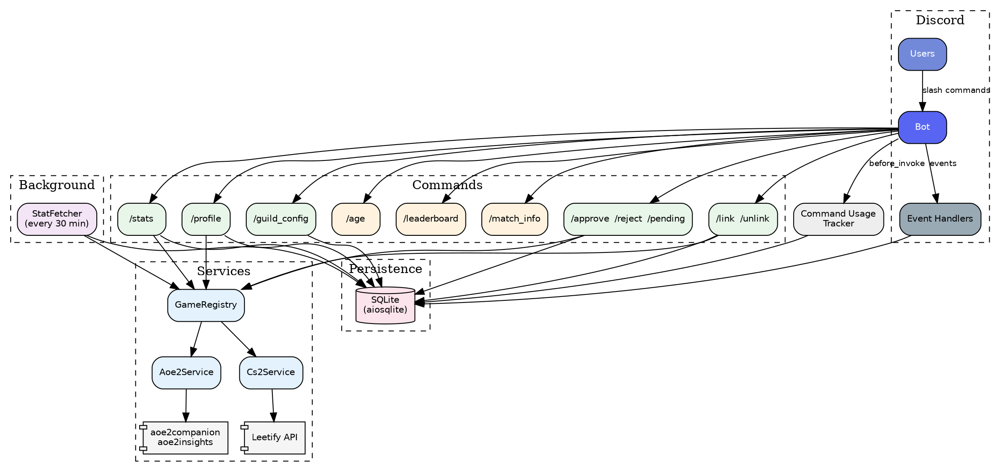

# dm4z-discord-app

[](https://codecov.io/gh/deathm4sterz/dm4z-discord-app)

Multi-game Discord bot implemented in Python with `py-cord`. Supports AoE2 and CS2 with a pluggable game service architecture, SQLite persistence, and background stat tracking.

## Architecture



## Features

### General commands

- `/age` -- account creation date for a user
- `/match_info` -- extracts a 9-digit match ID from text/link and posts action buttons
- Automatic message listener for `aoe2de` links

### Game commands

- `/profile [member] [player_name] [profile_id]` -- channel-aware game profile (AoE2 embeds, CS2 Leetify embeds)
- `/leaderboard` -- server-local AoE2 leaderboard via aoe2insights
- `/stats <game> [member]` -- cached stats for an approved linked account

### Account linking & moderation

- `/link <game> <account_id>` -- submit a link request (pending moderator approval)
- `/unlink <game>` -- remove a linked game account
- `/approve <member> <game>` -- approve a pending link (mod-only)
- `/reject <member> <game>` -- reject a pending link (mod-only)
- `/pending [game]` -- list pending link requests (mod-only)

### Guild configuration

- `/guild_config register_game <game> <channel>` -- register a game for the server
- `/guild_config disable_game <game>` -- disable a game

### Background jobs

- **Stat fetcher** -- polls game APIs every 30 minutes for all approved accounts, caching results in the database

## Requirements

- Python 3.12+
- Poetry 1.8+
- Discord bot token with message content intent enabled

## Local setup

```bash
poetry install --with dev
```

Create a `.env` file:

```env
DISCORD_TOKEN=your_token_here
LOG_LEVEL=INFO
DATABASE_PATH=dm4z_bot.db
```

Run locally:

```bash
poetry run python -m src.main
```

CLI arguments (`--discord-token`, `--log-level`, `--debug-guild-id`, `--database-path`) override env vars.

## Test Suite

Run lint and tests locally:

```bash
poetry run ruff check .
poetry run pytest
```

If you are using the project virtualenv (`.venv`) directly:

```bash
. .venv/Scripts/activate
PYTHONPATH=src python -m ruff check .
PYTHONPATH=src python -m pytest -q
```

> **Note:** `.venv` is the preferred virtual environment directory for this project.

### Reviewing Results

- `ruff check` passes when output is `All checks passed!`.
- `pytest` is configured to enforce code coverage:
  - coverage source: `src/`
  - minimum required coverage: `100%`
  - failing coverage exits non-zero (`--cov-fail-under=100`)
- terminal coverage details are shown with missing lines (`--cov-report=term-missing`)
- XML coverage report is written to `coverage.xml` for CI/report tooling
- CI uploads coverage to Codecov:
  - project dashboard: <https://codecov.io/gh/deathm4sterz/dm4z-discord-app>
  - pull requests include Codecov status checks against `.codecov.yml`

### Common Failures

- `ModuleNotFoundError: dm4z_bot`:
  - run tests with `PYTHONPATH=src` (or use Poetry which resolves package paths)
- coverage failure:
  - pytest output includes exact files/lines below threshold
- upstream dependency warnings:
  - warnings from py-cord internals can appear without indicating a test failure

## Docker

Build and run:

```bash
docker compose up --build
```

The container expects:

- `DISCORD_TOKEN`
- `LOG_LEVEL` (optional, default `INFO`)
- `DATABASE_PATH` (optional, default `dm4z_bot.db`)

## Project layout

```text
src/
  main.py
  dm4z_bot/
    bot.py
    config.py
    commands/
      age.py
      approve.py          # /approve, /reject, /pending
      guild_config.py
      leaderboard.py
      link.py             # /link, /unlink
      match_info.py
      profile.py          # /profile (channel-aware, AoE2 + CS2 embeds)
      stats.py
    database/
      db.py               # async SQLite manager
      migrations.py        # schema versioning
    events/
      guild_events.py      # on_guild_join / on_guild_remove
      member_events.py     # on_member_join / on_member_remove
      message_handler.py
    services/
      aoe2_api.py          # low-level AoE2 HTTP client
      games/
        base.py            # GameService protocol
        aoe2_service.py
        cs2_service.py
        registry.py        # GameRegistry
    tasks/
      stat_fetcher.py      # 30-min background loop
    utils/
tests/
```

